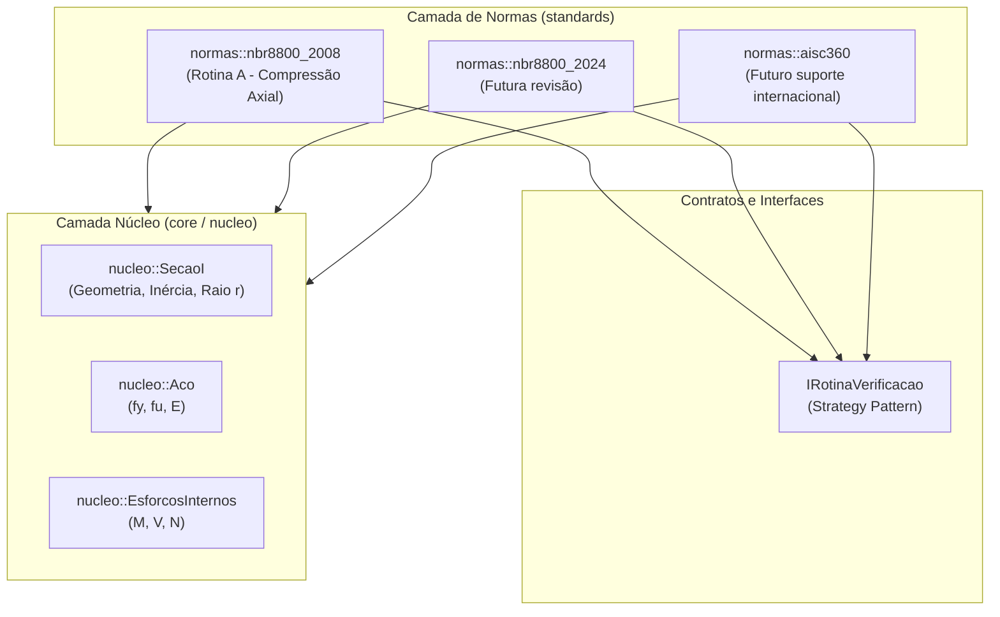

# Arquitetura de Software e Padrões de Projeto — VMP

Este documento descreve a arquitetura de software, os princípios de projeto e os *design patterns* aplicados no desenvolvimento do **VMP (Vigas Mistas e Protendidas)**, um software em C++ focado na verificação e dimensionamento de estruturas de aço, estruturas mistas e vigas mistas protendidas.

---

## 1. Visão Geral e Filosofia de Projeto

O software foi concebido com base em três pilares:
1. **Clean Architecture (Arquitetura Limpa):** Separação rigorosa entre a física/geometria da estrutura e as prescrições normativas regulatórias.
2. **TDD (Test-Driven Development):** Desenvolvimento orientado a testes, garantindo que toda formulação analítica seja aferida contra exemplos de validação (dissertações e manuais).
3. **C++ Simples e Direto:** Código limpo, sem dependências externas pesadas e sem sintaxes excessivamente complexas ou atributos modernos desnecessários (como `[[nodiscard]]`), facilitando a leitura por estudantes e engenheiros.

---

## 2. Estrutura de Camadas (Clean Architecture)



### Regra de Dependência (*The Dependency Rule*)
* **Núcleo (`vmp::nucleo`):** Representa o domínio da engenharia estrutural básica. Contém as propriedades geométricas de perfis ([`SecaoI`](include/nucleo/secao_i.hpp)), propriedades mecânicas dos materiais ([`Aco`](include/nucleo/material.hpp)) e esforços solicitantes ([`EsforcosInternos`](include/nucleo/esforcos_internos.hpp)). O núcleo **não depende de nenhuma norma**.
* **Normas (`vmp::normas`):** Consomem os dados do núcleo e aplicam as equações, limites de esbeltez e coeficientes de ponderação ($\gamma$) de cada norma específica.
* **Mecanismo de Proteção:** A separação é garantida pelas pastas (`include/nucleo/`, `include/normas/`), namespaces dedicados e pelo sistema de build (`CMakeLists.txt`).

---

## 3. Padrões de Projeto (*Design Patterns*) Aplicados

### A. Static Factory Method (Método Fabril Estático)
* **Onde:** [`SecaoI::w360x57_8()`](include/nucleo/secao_i.hpp) e [`Aco::a572_gr50()`](include/nucleo/material.hpp).
* **Problema:** Construtores com muitos parâmetros numéricos tornam o código ilegível e propenso a erros de inversão de argumentos.
* **Solução:** Métodos estáticos com nomes semânticos que encapsulam as propriedades oficiais de catálogos industriais (Gerdau, Açominas, ASTM):
  ```cpp
  SecaoI perfil = SecaoI::w360x57_8();
  Aco material = Aco::a572_gr50();
  ```

### B. Value Object / DTO (Data Transfer Object)
* **Onde:** [`ResultadoRotinaA`](include/normas/nbr8800_2008/rotina_a.hpp) e [`EsforcosInternos`](include/nucleo/esforcos_internos.hpp).
* **Problema:** Cálculos normativos produzem dezenas de resultados intermediários essenciais para a memória de cálculo ($N_{ex}, N_{ey}, Q_s, Q_a, \lambda_0, \chi, N_{Rd}$).
* **Solução:** Estruturas de dados diretas que agrupam esses valores, permitindo testes unitários granulares e emissão de relatórios completos.

### C. Strategy Pattern (Padrão Estratégia)
* **Onde:** [`include/normas/i_rotina_verificacao.hpp`](include/normas/i_rotina_verificacao.hpp).
* **Problema:** Como suportar múltiplas normas (NBR 8800:2008 vs. NBR 8800:2024 vs. AISC) sem poluir o código com condicionais `if/else`.
* **Solução:** Uma interface base abstrata de verificação permite que a aplicação consuma rotinas intercambiáveis em tempo de execução.

### D. Notification Pattern (Relatório de Verificação / Diagnóstico)
* **Problema:** Como tratar reprovações normativas (ex.: esbeltez excessiva $\frac{KL}{r} > 200$, falha por FLM, FLA ou $N_{Sd} > N_{Rd}$).
* **Decisão Arquitetural:** **Nunca lançar exceções (`throw`) para reprovações normativas.**
  * Em dimensionamento estrutural, a reprovação de um perfil ao iterar sobre um catálogo é um resultado legítimo do processo, não uma falha do software.
  * O padrão de Notificação retorna uma estrutura com o status da peça (`Aprovado`, `Aviso`, `Reprovado`) e a lista detalhada das verificações realizadas.

### E. Builder Pattern (Planejado para Seções Mistas)
* **Onde:** Montagem de vigas e pilares mistos.
* **Problema:** Vigas mistas possuem dezenas de parâmetros heterogêneos (perfil metálico, laje de concreto, conectores de cisalhamento, fôrma de aço).
* **Solução:** Um construtor fluente (`CompositeBeamBuilder`) para montar a viga passo a passo com validação de dados.

### F. Stage Accumulator / Timeline Pattern (Para Vigas Mistas Protendidas - VMP)
* **Problema:** Em vigas mistas protendidas, o cálculo é dependente do caminho e do tempo (*time-dependent*). As tensões finais são a soma dos incrementos sofridos em cada fase construtiva:
  $$\sigma_{final} = \sum_{i=1}^{n} \Delta \sigma_{fase, i}$$
* **Solução:** Um pipeline de estágios onde cada fase calcula o incremento de tensão $(\Delta \sigma)$ na seção correspondente:
  1. *Fase 1:* Aço isolado (peso próprio e pré-tensionamento);
  2. *Fase 2:* Concretagem (peso do concreto fresco na viga de aço);
  3. *Fase 3:* Pós-tensão mista (protensão atuando na seção homogeneizada curta duração $n_0$);
  4. *Fase 4:* Cargas de serviço imediatas;
  5. *Fase 5:* Efeitos de longo prazo (fluência, retração e relaxação com $n_\infty$).

---

## 4. Modelagem Física Real: O Raio de Concordância ($r$)

Nos perfis I e H laminados a quente, a transição entre mesa e alma possui um raio de adoçamento ($r$). A classe [`SecaoI`](include/nucleo/secao_i.hpp) incorpora esse efeito diretamente:

```text
       bf
  ┌──────────┐  ▲
  │   Mesa   │  │ tf
  └──┐    ┌──┘  ▼
     │ )r( │    ▲
     │  │  │    │ d1 (altura livre entre raios)
     │Alma │    │ 
     │  │  │    ▼
  ┌──┘ )r( └──┐ ▲
  │   Mesa   │  │ tf
  └──────────┘  ▼
```

### Equações Implementadas:
1. **Altura livre da alma ($d_1$):**
   * Laminados: $d_1 = d - 2 \cdot (t_f + r)$
   * Soldados: $d_1 = d - 2 \cdot t_f$
2. **Cota de concordância ($k$):**
   * $k = t_f + r$ (utilizada na dispersão de cargas concentradas e enrugamento da alma - NBR 8800 item 5.7).
3. **Área real dos cantos curvos ($\Delta A$):**
   * $\Delta A = 4 \times \left(1 - \frac{\pi}{4}\right) r^2 = (4 - \pi) r^2 \approx 0{,}8584 \cdot r^2$

---

## 5. Organização dos Diretórios do Código-Fonte

```text
VMP/
├── include/
│   ├── nucleo/
│   │   ├── secao_i.hpp              # Classe SecaoI e TipoFabricacao
│   │   ├── material.hpp             # Classe Aco (ASTM A36, A572 Gr 50)
│   │   └── esforcos_internos.hpp    # Struct EsforcosInternos
│   └── normas/
│       ├── i_rotina_verificacao.hpp # Interface base Strategy
│       └── nbr8800_2008/
│           └── rotina_a.hpp         # Rotina A (NBR 8800:2008)
├── src/
│   ├── main.cpp                     # Demonstração executável do programa
│   ├── nucleo/
│   │   ├── secao_i.cpp
│   │   └── material.cpp
│   └── normas/
│       └── nbr8800_2008/
│           └── rotina_a.cpp
├── tests/
│   ├── test_framework.hpp           # Microframework TDD zero-dependency
│   ├── test_main.cpp                # Ponto de entrada da suíte de testes
│   ├── nucleo/
│   │   └── test_secao_i.cpp         # Testes de geometria e raio r
│   └── normas/
│       └── nbr8800_2008/
│           └── test_rotina_a.cpp     # Testes analíticos da Rotina A
├── CMakeLists.txt                   # Build system com CONFIGURE_DEPENDS
├── ARQUITETURA.md                   # Este documento
└── README.md                        # Guia de execução rápido
```

---

## 6. Fluxo de Desenvolvimento TDD

1. **Red:** Escreve-se o caso de teste em `tests/` com base nos dados teóricos de exemplo da dissertação/norma.
2. **Green:** Implementa-se a fórmula correspondente em `src/` e cabeçalhos em `include/` até que o teste passe.
3. **Refactor:** Limpa-se a assinatura, simplifica-se o código e preserva-se a execução contínua via `.\build\vmp_tests.exe`.
