# Roadmap de Implementação — VMP (Vigas Mistas e Protendidas)

Este documento estabelece o **plano de desenvolvimento sequencial** para o software **VMP**, baseado na metodologia e nos fluxogramas de cálculo extraídos da dissertação de mestrado de **Thiago Tononi Turini (UFES, 2021)**: *"VMPCalc — Programa para Cálculo de Vigas Mistas Protendidas"*.

---

## 1. Mapeamento Geral das Rotinas do Documento

A dissertação divide as rotinas de cálculo em dois grupos complementares:
* **Rotinas Normativas Básicas (Letras A a H):** Procedimentos clássicos das normas ABNT NBR 8800:2008 e ABNT NBR 6118:2014 para perfis I de aço e vigas mistas convencionais.
* **Rotinas Específicas do VMP (Números 1 a 6):** Formulações analíticas desenvolvidas para o comportamento conjunto da viga mista com protensão (seção transformada, perdas, incremento hiperestático $\Delta P$ e momento resistente de VMP).

```mermaid
flowchart TD
    subgraph Nucleo ["1. Modelos do Núcleo (Domínio)"]
        Perfil["SecaoI + Aco"]
        Laje["Concreto + Laje (Maciça / Steel Deck)"]
        ArmPassiva["ArmaduraPassiva (Asl, As,fis)"]
        Cabo["CaboProtensao (Reto / Poligonal, CP-190)"]
        Conector["ConectorCisalhamento (Stud Bolt / Perfil U)"]
        Cargas["CarregamentoVMP (q1, q2, qs, q3, q4)"]
    end

    subgraph NormasBasicas ["2. Rotinas de Norma (Letras)"]
        RotA["Rotina A: Compressão Perfil I (CONCLUÍDA)"]
        RotD["Rotina D: Força Cortante (VRd)"]
        RotB["Rotina B: Flexão Perfil I (FLT, FLM, FLA)"]
        RotE["Rotina E: Conectores (QRd, nl)"]
        RotF["Rotina F: Armadura de Costura (As,cos)"]
        RotG["Rotina G: Inércia da Laje por metro (I2)"]
        RotC["Rotina C: Flexão Viga Mista Convencional"]
        RotH["Rotina H: Tensão no Cabo em ELU (σpd)"]
    end

    subgraph RotinasVMP ["3. Rotinas Especializadas VMP (Números)"]
        Rot1["Rotina 1: Seção Transformada (ytr, Atr, Itr)"]
        Rot6["Rotina 6: Incremento Hiperestático (ΔP)"]
        Rot5["Rotina 5 e 5.1: Perdas de Protensão (Atrito, Cunha, Relaxação)"]
        Rot4["Rotina 4: Quantidade de Cabos (Ap, ncabos)"]
        Rot2["Rotina 2: Estimativa da Força Máxima (P0)"]
        Rot3["Rotina 3: Momento Resistente VMP (Plástico / Elástico / FLD)"]
    end

    subgraph Orquestrador ["4. Orquestrador de Fases e Aferição"]
        Fases["VerificadorVMP: ELU 1, ELU 2, ELU 3, ELS Flecha, ELS Vibração"]
        Exemplo1["Aferição Exemplo 1: Pré-tração + Reto + Laje Maciça"]
        Exemplo2["Aferição Exemplo 2: Pós-tração + Poligonal + Laje Mista"]
    end

    Nucleo --> NormasBasicas
    Nucleo --> RotinasVMP
    NormasBasicas --> RotinasVMP
    RotinasVMP --> Orquestrador
```



---

## 2. Etapa 1: Expansão do Núcleo de Domínio (`nucleo/`)

Antes de implementar as rotinas complexas, o núcleo agnóstico de normas precisa receber as novas classes de entrada de dados descritas no item 3.1.2 e 3.2 da dissertação.

### Novas Classes e Estruturas:

1. **[`include/nucleo/concreto.hpp`](include/nucleo/concreto.hpp):**
   * Classe `Concreto`: resistência característica $f_{ck}$ (ex.: C30), agregado (Granito, Basalto, etc.), módulo secante $E_{cs}$, resistência à tração $f_{ctm} = 0{,}3 \cdot f_{ck}^{2/3}$.
2. **[`include/nucleo/laje.hpp`](include/nucleo/laje.hpp):**
   * Classe `Laje`: tipo (`TipoLaje::Macica` ou `TipoLaje::Mista`), espessura da laje $t_c$, altura da fôrma $h_F$, modelo da fôrma de aço (`MF-50`, `MF-75`, `Polydeck 59S`), espessura da chapa ($0{,}8$, $0{,}95$ ou $1{,}25\text{ mm}$), orientação das nervuras (`Paralela` ou `Perpendicular`).
3. **[`include/nucleo/armadura_passiva.hpp`](include/nucleo/armadura_passiva.hpp):**
   * Classe `ArmaduraPassiva`: área longitudinal superior/inferior ($A_{sl,pa}$, $A_{sl,pe}$), armadura de combate à fissuração ($A_{s,fis}$), cobrimento $d'$, classe do aço (`CA-25`, `CA-50`, `CA-60`).
4. **[`include/nucleo/cabo_protensao.hpp`](include/nucleo/cabo_protensao.hpp):**
   * Classe `CaboProtensao`: aço de protensão (`CP-190 RB`), módulo $E_p$, diâmetro da cordoalha $\phi_p$, tipo de traçado (`TipoTracado::Reto` ou `TipoTracado::Poligonal`), excentricidade no meio do vão $e_p$, posição do desviador $X_{ep}$, tipo de protensão (`PreTracao` ou `PosTracao`), operação das ancoragens (`AtivaAtiva` ou `AtivaPassiva`), acomodação da cunha $\delta_P$.
5. **[`include/nucleo/conector_cisalhamento.hpp`](include/nucleo/conector_cisalhamento.hpp):**
   * Classe `ConectorCisalhamento`: tipo (`StudBolt` de $19\text{ mm}$ ou `PerfilU`), dimensões ($L_{cs}, t_f, t_w, h_w$), aço (ASTM A108 / ZAR 280), fatores $R_g$ e $R_p$.
6. **[`include/nucleo/carregamento_vmp.hpp`](include/nucleo/carregamento_vmp.hpp):**
   * Classe `CarregamentoVMP`: cargas permanentes distribuídas $q_1$ (perfil), $q_2$ (concreto fresco), $q_3$ (revestimento/acabamento), sobrecarga de construção $q_s$, sobrecarga de uso $q_4$, fatores de combinação ($\psi_1, \psi_2$), tipo de escoramento (`Escorada` vs `NaoEscorada`).

---

## 3. Etapa 2: Rotinas Normativas Básicas (`normas/nbr8800_2008/`)

Implementação das rotinas alfabetizadas (Tabela 9 e Apêndice A do documento):

| Ordem | Rotina | Arquivo | Responsabilidade Técnica | Dependências | Status |
| :---: | :---: | :--- | :--- | :--- | :---: |
| **2.0** | **Rotina A** | `rotina_a.hpp` | Força axial resistente de cálculo do perfil I ($N_{Rd,a}$) | `SecaoI`, `Aco` | **Concluída** |
| **2.1** | **Rotina D** | `rotina_d.hpp` | Força cortante resistente de cálculo do perfil I ($V_{Rd}$) | `SecaoI`, `Aco` | Pendente |
| **2.2** | **Rotina B** | `rotina_b.hpp` | Momento fletor resistente de cálculo do perfil I ($M_{Rd,a}$): FLT (B.1), FLM (B.2), FLA (B.3) | `SecaoI`, `Aco` | Pendente |
| **2.3** | **Rotina E** | `rotina_e.hpp` | Conectores de cisalhamento: capacidade nominal $Q_{Rd}$, força longitudinal $F_{hd}$, número total $n_l$ e espaçamentos $e_l, e_t$ | `Conector`, `Laje`, `Concreto` | Pendente |
| **2.4** | **Rotina F** | `rotina_f.hpp` | Armadura de costura contra fendilhamento longitudinal: $H_{v,sd}$, $H_{v,Rd,max}$, $A_{s,cos}$ e ancoragem $l_b$ | `Laje`, `Concreto`, `Armadura` | Pendente |
| **2.5** | **Rotina G** | `rotina_g.hpp` | Momento de inércia da laje por metro ($I_2$) no Estágio II para vigas com momento negativo | `Laje`, `Concreto`, `Armadura` | Pendente |
| **2.6** | **Rotina C** | `rotina_c.hpp` | Momento resistente de viga mista convencional ($M_{Rd,VM}^+, M_{Rd,VM}^-$): C.1 Plástica, C.2 Elástica, C.3 Negativa com FLD | `Rotina G`, `SecaoI`, `Laje` | Pendente |
| **2.7** | **Rotina H** | `rotina_h.hpp` | Tensão de cálculo no cabo de protensão para ELU ($\sigma_{pd}$) para pré e pós-tração | `CaboProtensao`, `Rotina 1` | Pendente |

---

## 4. Etapa 3: Rotinas Especializadas de Vigas Mistas Protendidas (`normas/vmp/`)

Implementação das rotinas numéricas numeradas (Tabela 8 e Apêndice A do documento):

### 3.1. Rotina 1 — Seção Transformada e Homogeneizada
* **Arquivo:** `include/normas/vmp/rotina_1.hpp`
* **Objetivo:** Determinar a largura efetiva $b_{ef}$, relação modular $\alpha_e$ para curto prazo ($t=0$: $\alpha_e = E_a/E_{cs}$) e longo prazo ($t=\infty$: $\alpha_e = 3E_a/E_{cs}$), posição da linha neutra elástica $y_{tr}$, área transformada $A_{tr}$ e inércia $I_{tr}$.

### 3.2. Rotina 6 — Incremento Hiperestático da Força de Protensão ($\Delta P$)
* **Arquivo:** `include/normas/vmp/rotina_6.hpp`
* **Objetivo:** Como a viga biapoiada com cabo ancorado torna-se internamente hiperestática de 1º grau, qualquer carga nova $q$ induz um acréscimo de tração no cabo:
  * Formulação para traçado reto: $\Delta P = \frac{q \cdot e_p \cdot L_v^3}{12 \left(e_p^2 + \frac{E I_{tr}}{E_p A_p} + \frac{I_{tr}}{A_{tr}}\right)}$
  * Formulação pelo método das forças para traçado poligonal com comprimento inclinado $X_{ep}$ ($\Delta P = \delta_{1d} / \delta_{11}$).

### 3.3. Rotinas 5 e 5.1 — Perdas Imediatas e Progressivas de Protensão
* **Arquivo:** `include/normas/vmp/rotina_5.hpp`
* **Objetivo:**
  * **Imediatas (Rotina 5.1):** Atrito nos desviadores para cabo poligonal ($e^{-\mu \alpha}$) e acomodação de cunha na ancoragem ($\delta_P$) para configurações Ativa-Ativa e Ativa-Passiva.
  * **Progressivas (Rotina 5):** Perda diferida por relaxação das cordoalhas a $t=\infty$ baseada na tabela de $\psi_{1000}$ multiplicada pelo fator $2{,}5$.

### 3.4. Rotina 4 — Dimensionamento da Armadura de Protensão
* **Arquivo:** `include/normas/vmp/rotina_4.hpp`
* **Objetivo:** A partir da força $P_0$ estimada, calcular a área necessária $A_p = P_0 / \sigma_{pi}$ e o número inteiro de cordoalhas $n_{cabos} = \lceil A_p / A_{p1\phi} \rceil$, respeitando os limites normativos da NBR 6118:
  * Pré-tração: $\sigma_{pi} \le \min(0{,}77 f_{ptk}, 0{,}85 f_{pyk})$
  * Pós-tração: $\sigma_{pi} \le \min(0{,}80 f_{ptk}, 0{,}88 f_{pyk})$

### 3.5. Rotina 2 — Estimativa da Força Máxima de Protensão ($P_0$)
* **Arquivo:** `include/normas/vmp/rotina_2.hpp`
* **Objetivo:** Achar o valor admissível máximo $P_0 = \min(|P_{0,max,1}|, |P_{0,max,2}|)$:
  * $P_{0,max,1}$: Limite de flexo-compressão na fase construtiva da viga metálica (NBR 8800 item 5.5.1.2);
  * $P_{0,max,2}$: Limite de tensões em serviço no concreto (NBR 6118 — descompressão e compressão máxima $\sigma_c \le 0{,}6 f_{ck}$).

### 3.6. Rotina 3 — Momento Fletor Resistente da VMP ($M_{Rd,VMP}^+, M_{Rd,VMP}^-$)
* **Arquivo:** `include/normas/vmp/rotina_3.hpp`
* **Sub-rotinas:**
  * **3.1 (Momento Positivo Compacto):** Análise rígido-plástica considerando o cabo de protensão tracionado com $T_{pd} = A_p \sigma_{pd}$. Identifica se a LNP está na laje, na mesa superior ou na alma.
  * **3.2 (Momento Positivo Semicompacto):** Análise elástica baseada em $W_{tr}$ e tensões limites de escoamento.
  * **3.3 (Momento Negativo em VMP):** 3.3.1 Plástica com armaduras passivas tracionadas + 3.3.2 FLD (Flambagem Lateral Distorcional) com rigidez de mola $k_r$ e fator de redução $\chi_{dist}$.

---

## 5. Etapa 4: Orquestrador de Fases (ELU e ELS)

Criar a classe de coordenação central [`VerificadorVMP`](include/normas/vmp/verificador_vmp.hpp), responsável por processar as 5 etapas da vida útil da viga:

```text
               ┌─────────────────────────────────────────────────┐
               │                VerificadorVMP                   │
               └───────────────────────┬─────────────────────────┘
                                       │
         ┌─────────────────────────────┼─────────────────────────────┐
         ▼                             ▼                             ▼
   [ Fase 1: ELU ]               [ Fase 2: ELU ]               [ Fase 3: ELU ]
   Montagem / Cura               Seção Mista t=0              Longa Duração t=∞
   - q1 + q2 + qs + P            - q1 + q2 + q3 + q4          - Perdas e fluência
   - Rotinas A, B, D             - Rotinas 3, D, FlexoComp    - Rotinas 3, D, FlexoComp
         │                             │                             │
         └─────────────────────────────┼─────────────────────────────┘
                                       │
                         ┌─────────────┴─────────────┐
                         ▼                           ▼
                   [ Fase 4: ELS ]             [ Fase 5: ELS ]
                   Deformação Flechas          Vibração no Piso
                   (δmax ≤ δlim)               (Anexo L NBR 8800)
```

---

## 6. Etapa 5: Suíte de Testes TDD com os Dois Casos de Aferição da Dissertação

A validação do software deve ser realizada diretamente contra as tabelas numéricas dos dois exemplos completos resolvidos na dissertação:

### 🎯 Teste de Aferição 1: VMP Pré-Tracionada com Traçado Reto e Laje Maciça
* **Dados de entrada:** Tabela 10 do documento ($L_v = 12\text{ m}$, perfil W 360 x 57.8, A572 Gr. 50, laje $t_c = 130\text{ mm}$, $e_p = -50\text{ mm}$, 3 cordoalhas CP-190 RB, conectores U 75x40x4.75).
* **Alvos de Aferição (tolerância < 0.5%):**
  * Tabela 11: Conectores ($Q_{Rd} = 76{,}72\text{ kN}$, $A_{s,cos} = 2{,}6\text{ cm}^2/\text{m}$);
  * Tabela 12: Força máxima $P_0 = 912{,}64\text{ kN}$ ($P_{0,8800} = 912{,}64\text{ kN}$, $P_{0,6118} = 1431{,}28\text{ kN}$);
  * Tabela 13: ELU 1 ($P_1 = 404{,}63\text{ kN}$, $M_{Sd}^+ = 259{,}04\text{ kN}\cdot\text{m}$, $V_{Rd} = 532{,}22\text{ kN}$);
  * Tabela 14: ELU 2 ($P_2 = 448{,}42\text{ kN}$, $M_{Rd,VMP}^+ = 807{,}87\text{ kN}\cdot\text{m}$, $M_{Rd,VMP}^- = 354{,}50\text{ kN}\cdot\text{m}$);
  * Tabela 15: ELU 3 ($P_3 = 437{,}81\text{ kN}$, $M_{Rd,VMP}^+ = 802{,}53\text{ kN}\cdot\text{m}$);
  * Tabela 16: ELS Deformação ($\delta_{max} = 3{,}43\text{ cm}$, contra-flecha protensão $\delta_p = -2{,}91\text{ cm}$);
  * Tabela 17: ELS Vibração ($\delta_{max} = 2{,}00\text{ cm}$).

### 🎯 Teste de Aferição 2: VMP Pós-Tracionada com Traçado Poligonal e Laje Mista (Steel Deck)
* **Dados de entrada:** Tabela 18 do documento ($L_v = 15\text{ m}$, perfil W 460 x 89, A572 Gr. 50, fôrma MF-50, $t_c = 130\text{ mm}$, $e_p = -50\text{ mm}$, $X_{ep} = 5000\text{ mm}$, 3 cordoalhas, conectores Stud Bolt $\phi = 19\text{ mm}$).
* **Alvos de Aferição (tolerância < 0.5%):**
  * Tabela 19: Conectores Stud Bolt ($Q_{Rd} = 48{,}01\text{ kN}$);
  * Tabela 20: Força máxima pós-tração ($P_0 = 1165{,}50\text{ kN}$);
  * Tabela 21: ELU 1 viga mista sem protensão ($M_{Sd}^+ = 348{,}80\text{ kN}\cdot\text{m}$, $M_{Rd}^+ = 1296{,}82\text{ kN}\cdot\text{m}$, $V_{Rd} = 914{,}85\text{ kN}$);
  * Tabelas 22 a 26: ELU 2 analisado por seções discretas (Seção Ativa 0, Seção Ativa 1, Meio do Vão, Seções Passivas);
  * Tabelas 27 a 33: ELU 3 com perdas diferidas e ELS.

---

## 7. Cronograma e Ordem Prioritária de Tarefas (Sprints)

| Sprint | Foco Principal | Entregáveis |
| :---: | :--- | :--- |
| **Sprint 1** | **Núcleo de Entidades** | Classes `Concreto`, `Laje`, `CaboProtensao`, `ConectorCisalhamento`, `CarregamentoVMP`. Testes unitários de geometria e propriedades. |
| **Sprint 2** | **Rotinas Perfil I (D e B)** | Implementação das Rotinas D ($V_{Rd}$) e B ($M_{Rd,a}$: FLT, FLM, FLA). Testes contra perfis padrão W 360x57.8 e W 460x89. |
| **Sprint 3** | **Conexão e Interação (E, F, G)** | Implementação dos Conectores (Rotina E), Armadura de Costura (Rotina F) e Inércia da Laje Estágio II (Rotina G). |
| **Sprint 4** | **Hiperestaticidade e Cabos (1, 6, 5, 4, H)** | Seção Transformada (Rotina 1), Incremento $\Delta P$ (Rotina 6), Perdas imediatas/progressivas (Rotina 5/5.1), Força $P_0$ (Rotina 2) e Cabos (Rotina 4). |
| **Sprint 5** | **Flexão Mista e VMP (C e 3)** | Rotina C (viga mista convencional) e Rotina 3 (VMP: 3.1 plástico positivo, 3.2 elástico positivo e 3.3 negativo com FLD). |
| **Sprint 6** | **Pipeline Global de Fases (ELU/ELS)** | Coordenação das fases 1 a 5 no `VerificadorVMP`. Testes de aferição completos do Exemplo 1 e Exemplo 2 da dissertação. |
